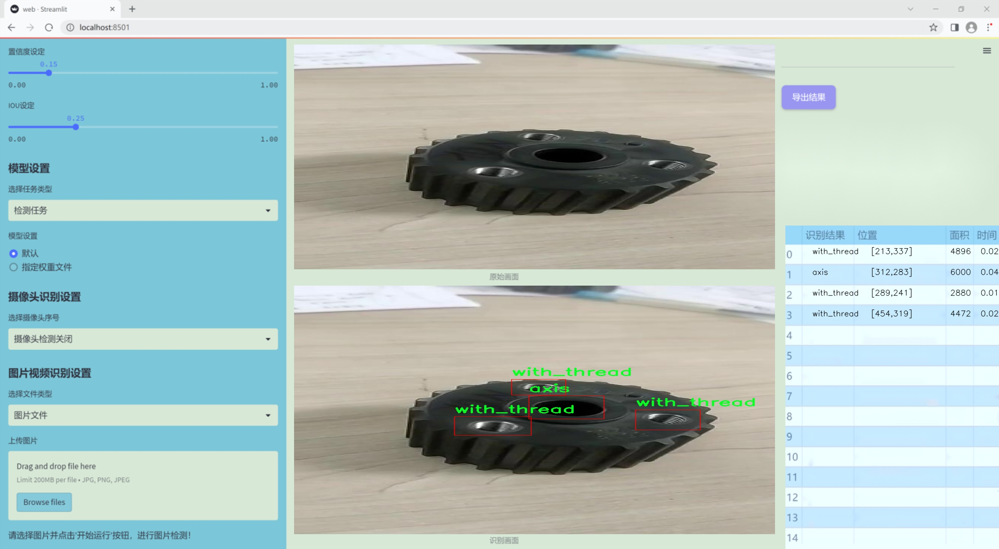
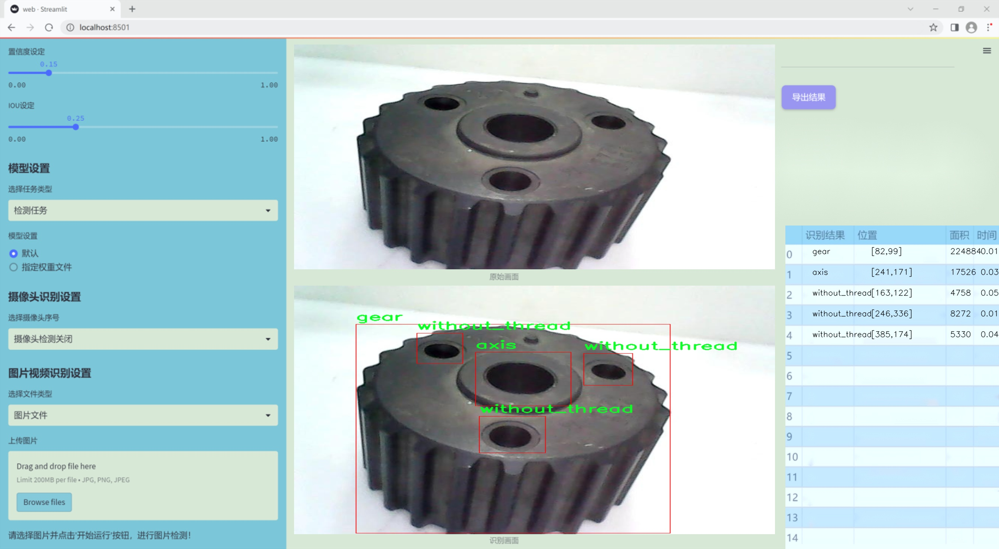
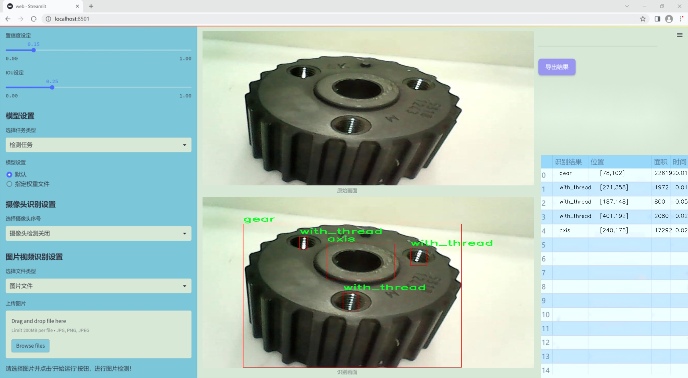
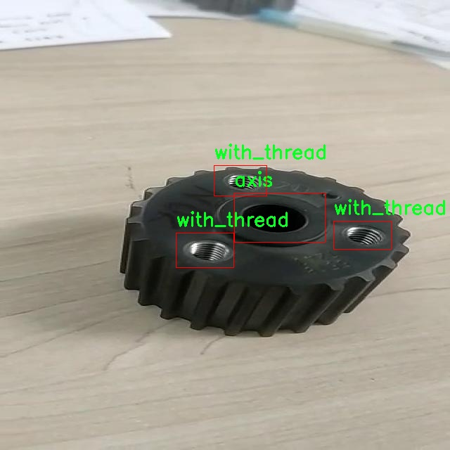
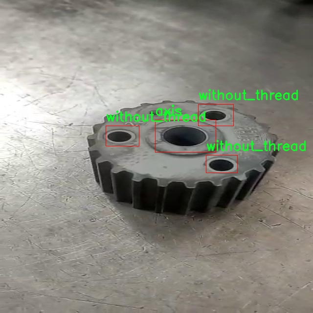
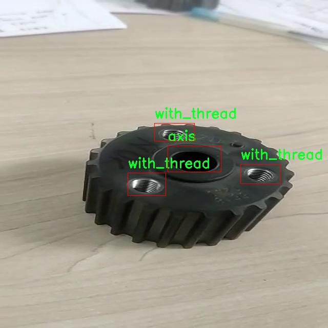
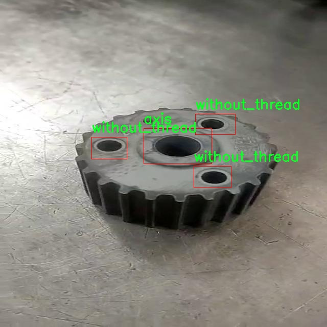
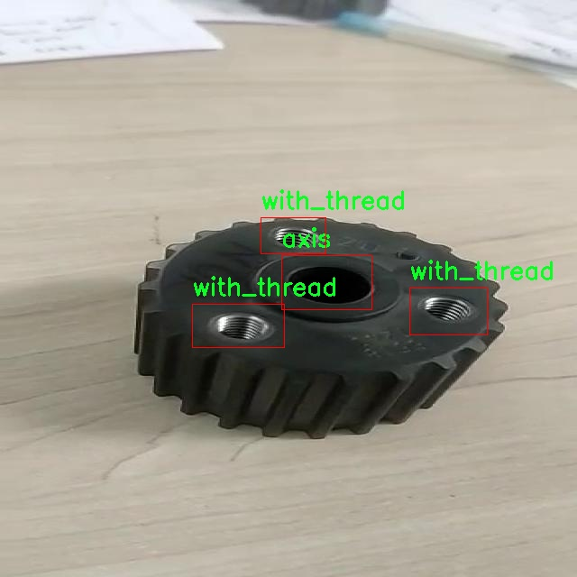

### 1.背景意义

研究背景与意义

随着工业自动化和智能制造的快速发展，机器视觉技术在生产线上的应用愈发广泛。螺纹和孔的检测作为机械零部件质量控制的重要环节，直接影响到产品的性能和安全性。传统的人工检测方法不仅效率低下，而且容易受到人为因素的影响，导致检测结果的不一致性。因此，开发一种高效、准确的自动检测系统显得尤为重要。

本研究旨在基于改进的YOLOv11模型，构建一个针对螺纹与孔的检测系统。YOLO（You Only Look Once）系列模型因其高效的实时检测能力而受到广泛关注，尤其在工业应用中表现出色。通过对YOLOv11进行改进，我们期望在提高检测精度的同时，进一步提升模型的处理速度，以满足工业生产对实时性的严格要求。

本项目所使用的数据集包含四个类别：轴、齿轮、带螺纹和不带螺纹。数据集的多样性和丰富性为模型的训练提供了良好的基础，能够有效地涵盖不同类型的螺纹和孔的特征。这一数据集的构建不仅为模型的训练提供了支持，也为后续的模型评估和优化奠定了基础。

通过本研究的实施，我们希望能够为工业界提供一种高效的螺纹与孔检测解决方案，降低人工成本，提高生产效率。同时，研究成果也将为后续的相关研究提供参考，推动机器视觉技术在更广泛领域的应用。综上所述，本项目不仅具有重要的理论意义，也具有显著的实际应用价值。

### 2.视频效果

[2.1 视频效果](https://www.bilibili.com/video/BV1YEm1Y5E9S/)

### 3.图片效果







##### [项目涉及的源码数据来源链接](https://kdocs.cn/l/cszuIiCKVNis)**

注意：本项目提供训练的数据集和训练教程,由于版本持续更新,暂不提供权重文件（best.pt）,请按照6.训练教程进行训练后实现上图演示的效果。

### 4.数据集信息

##### 4.1 本项目数据集类别数＆类别名

nc: 4
names: ['axis', 'gear', 'with_thread', 'without_thread']


该项目为【目标检测】数据集，请在【训练教程和Web端加载模型教程（第三步）】这一步的时候按照【目标检测】部分的教程来训练

##### 4.2 本项目数据集信息介绍

本项目数据集信息介绍

本项目所使用的数据集专门针对改进YOLOv11模型在螺类检测任务中的应用而构建。该数据集涵盖了多种螺类的图像，旨在为模型提供丰富的训练样本，以提高其在实际应用中的识别精度和鲁棒性。数据集中的图像来源于多个自然栖息地，包括海洋、淡水和陆地环境，确保了样本的多样性和代表性。此外，数据集还包含了不同光照条件、角度和背景下的螺类图像，以模拟现实世界中可能遇到的各种场景。

为了增强数据集的实用性，我们对图像进行了精细的标注，标注信息包括螺类的种类、位置以及尺寸等。这些标注不仅有助于模型的训练，还为后续的评估和分析提供了重要依据。数据集中的螺类样本涵盖了常见的几种类型，如海螺、淡水螺和陆生螺，确保了模型在不同种类螺类识别上的全面性。

在数据集的构建过程中，我们还应用了数据增强技术，通过旋转、缩放、裁剪等方式生成了多样化的训练样本。这种方法不仅提高了数据集的规模，还有效防止了模型的过拟合现象。最终，数据集的规模达到了数千张高质量图像，充分满足了YOLOv11模型训练的需求。

通过这一数据集的构建与应用，我们期望能够显著提升YOLOv11在螺类检测任务中的性能，为相关领域的研究和应用提供坚实的数据基础。











### 5.全套项目环境部署视频教程（零基础手把手教学）

[5.1 所需软件PyCharm和Anaconda安装教程（第一步）](https://www.bilibili.com/video/BV1BoC1YCEKi/?spm_id_from=333.999.0.0&vd_source=bc9aec86d164b67a7004b996143742dc)


[5.2 安装Python虚拟环境创建和依赖库安装视频教程（第二步）](https://www.bilibili.com/video/BV1ZoC1YCEBw?spm_id_from=333.788.videopod.sections&vd_source=bc9aec86d164b67a7004b996143742dc)

### 6.改进YOLOv11训练教程和Web_UI前端加载模型教程（零基础手把手教学）

[6.1 改进YOLOv11训练教程和Web_UI前端加载模型教程（第三步）](https://www.bilibili.com/video/BV1BoC1YCEhR?spm_id_from=333.788.videopod.sections&vd_source=bc9aec86d164b67a7004b996143742dc)


按照上面的训练视频教程链接加载项目提供的数据集，运行train.py即可开始训练



     Epoch   gpu_mem       box       obj       cls    labels  img_size
     1/200     20.8G   0.01576   0.01955  0.007536        22      1280: 100%|██████████| 849/849 [14:42<00:00,  1.04s/it]
               Class     Images     Labels          P          R     mAP@.5 mAP@.5:.95: 100%|██████████| 213/213 [01:14<00:00,  2.87it/s]
                 all       3395      17314      0.994      0.957      0.0957      0.0843

     Epoch   gpu_mem       box       obj       cls    labels  img_size
     2/200     20.8G   0.01578   0.01923  0.007006        22      1280: 100%|██████████| 849/849 [14:44<00:00,  1.04s/it]
               Class     Images     Labels          P          R     mAP@.5 mAP@.5:.95: 100%|██████████| 213/213 [01:12<00:00,  2.95it/s]
                 all       3395      17314      0.996      0.956      0.0957      0.0845

     Epoch   gpu_mem       box       obj       cls    labels  img_size
     3/200     20.8G   0.01561    0.0191  0.006895        27      1280: 100%|██████████| 849/849 [10:56<00:00,  1.29it/s]
               Class     Images     Labels          P          R     mAP@.5 mAP@.5:.95: 100%|███████   | 187/213 [00:52<00:00,  4.04it/s]
                 all       3395      17314      0.996      0.957      0.0957      0.0845


###### [项目数据集下载链接](https://kdocs.cn/l/cszuIiCKVNis)

### 7.原始YOLOv11算法讲解


ultralytics发布了最新的作品YOLOv11，这一次YOLOv11的变化相对于ultralytics公司的上一代作品YOLOv8变化不是很大的（YOLOv9、YOLOv10均不是ultralytics公司作品），其中改变的位置涉及到C2f变为C3K2，在SPPF后面加了一层类似于注意力机制的C2PSA，还有一个变化大家从yaml文件是看不出来的就是它的检测头内部替换了两个DWConv，以及模型的深度和宽度参数进行了大幅度调整，但是在损失函数方面就没有变化还是采用的CIoU作为边界框回归损失，下面带大家深入理解一下ultralytics最新作品YOLOv11的创新点。

**下图为最近的YOLO系列发布时间线！**


* * *

###### YOLOv11和YOLOv8对比

在YOLOYOLOv5，YOLOv8，和YOLOv11是ultralytics公司作品（ultralytics出品必属精品），下面用一张图片从yaml文件来带大家对比一下YOLOv8和YOLOv11的区别，配置文件变得内容比较少大家可以看一卡，左侧为YOLOv8右侧为YOLOv11，不同的点我用黑线标注了出来。


* * *

###### YOLOv11的网络结构解析

下面的图片为YOLOv11的网络结构图。


**其中主要创新点可以总结如下- > **

* * *

1\.
提出C3k2机制，其中C3k2有参数为c3k，其中在网络的浅层c3k设置为False（下图中可以看到c3k2第二个参数被设置为False，就是对应的c3k参数）。


此时所谓的C3k2就相当于YOLOv8中的C2f，其网络结构为一致的，其中的C3k机制的网络结构图如下图所示
**（为什么叫C3k2，我个人理解是因为C3k的调用时C3k其中的参数N固定设置为2的原因，个人理解不一定对** ）。


* * *

2\.
第二个创新点是提出C2PSA机制，这是一个C2（C2f的前身）机制内部嵌入了一个多头注意力机制，在这个过程中我还发现作者尝试了C2fPSA机制但是估计效果不如C2PSA，有的时候机制有没有效果理论上真的很难解释通，下图为C2PSA机制的原理图，仔细观察把Attention哪里去掉则C2PSA机制就变为了C2所以我上面说C2PSA就是C2里面嵌入了一个PSA机制。


* * *

3\.
第三个创新点可以说是原先的解耦头中的分类检测头增加了两个DWConv，具体的对比大家可以看下面两个图下面的是YOLOv11的解耦头，上面的是YOLOv8的解耦头.


我们上面看到了在分类检测头中YOLOv11插入了两个DWConv这样的做法可以大幅度减少参数量和计算量（原先两个普通的Conv大家要注意到卷积和是由3变为了1的，这是形成了两个深度可分离Conv），大家可能不太理解为什么加入了两个DWConv还能够减少计算量，以及什么是深度可分离Conv，下面我来解释一下。

> **`DWConv` 代表 Depthwise
> Convolution（深度卷积）**，是一种在卷积神经网络中常用的高效卷积操作。它主要用于减少计算复杂度和参数量，尤其在移动端或轻量化网络（如
> MobileNet）中十分常见。
>
> **1\. 标准卷积的计算过程**
>
> 在标准卷积操作中，对于一个输入张量（通常是一个多通道的特征图），卷积核的尺寸是 `(h, w, C_in)`，其中 `h` 和 `w`
> 是卷积核的空间尺寸，`C_in`
> 是输入通道的数量。而卷积核与输入张量做的是完整的卷积运算，每个输出通道都与所有输入通道相连并参与卷积操作，导致计算量比较大。
>
> 标准卷积的计算过程是这样的：
>
>   * 每个输出通道是所有输入通道的组合（加权求和），卷积核在每个位置都会计算与所有输入通道的点积。
>   * 假设有 `C_in` 个输入通道和 `C_out` 个输出通道，那么卷积核的总参数量是 `C_in * C_out * h * w`。
>

>
> 2\. **Depthwise Convolution（DWConv）**
>
> 与标准卷积不同， **深度卷积** 将输入的每个通道单独处理，即 **每个通道都有自己的卷积核进行卷积**
> ，不与其他通道进行交互。它可以被看作是标准卷积的一部分，专注于空间维度上的卷积运算。
>
> **深度卷积的计算过程：**
>
>   * 假设输入张量有 `C_in` 个通道，每个通道会使用一个 `h × w`
> 的卷积核进行卷积操作。这个过程称为“深度卷积”，因为每个通道独立进行卷积运算。
>   * 输出的通道数与输入通道数一致，每个输出通道只和对应的输入通道进行卷积，没有跨通道的组合。
>   * 参数量和计算量相比标准卷积大大减少，卷积核的参数量是 `C_in * h * w`。
>

>
> **深度卷积的优点：**
>
>   1. **计算效率高** ：相对于标准卷积，深度卷积显著减少了计算量。它只处理空间维度上的卷积，不再处理通道间的卷积。
>   2.  **参数量减少** ：由于每个卷积核只对单个通道进行卷积，参数量大幅减少。例如，标准卷积的参数量为 `C_in * C_out * h *
> w`，而深度卷积的参数量为 `C_in * h * w`。
>   3.  **结合点卷积可提升效果** ：为了弥补深度卷积缺乏跨通道信息整合的问题，通常深度卷积后会配合 `1x1` 的点卷积（Pointwise
> Convolution）使用，通过 `1x1` 的卷积核整合跨通道的信息。这种组合被称为 **深度可分离卷积** （Depthwise
> Separable Convolution） | **这也是我们本文YOLOv11中的做法** 。
>

>
> 3\. **深度卷积与标准卷积的区别**
>
> 操作类型| 卷积核大小| 输入通道数| 输出通道数| 参数量  
> ---|---|---|---|---  
> 标准卷积| `h × w`| `C_in`| `C_out`| `C_in * C_out * h * w`  
> 深度卷积（DWConv）| `h × w`| `C_in`| `C_in`| `C_in * h * w`  
>  
> 可以看出，深度卷积在相同的卷积核大小下，参数量减少了约 `C_out` 倍
> （细心的人可以发现用最新版本的ultralytics仓库运行YOLOv8参数量相比于之前的YOLOv8以及大幅度减少了这就是因为检测头改了的原因但是名字还是Detect，所以如果你想继续用YOLOv8发表论文做实验那么不要更新最近的ultralytics仓库）。
>
> **4\. 深度可分离卷积 (Depthwise Separable Convolution)**
>
> 深度卷积常与 `1x1` 的点卷积配合使用，这称为深度可分离卷积。其过程如下：
>
>   1. 先对输入张量进行深度卷积，对每个通道独立进行空间卷积。
>   2. 然后通过 `1x1` 点卷积，对通道维度进行混合，整合不同通道的信息。
>

>
> 这样既可以保证计算量的减少，又可以保持跨通道的信息流动。
>
> 5\. **总结**
>
> `DWConv` 是一种高效的卷积方式，通过单独处理每个通道来减少计算量，结合 `1x1`
> 的点卷积，形成深度可分离卷积，可以在保持网络性能的同时极大地减少模型的计算复杂度和参数量。

**看到这里大家应该明白了为什么加入了两个DWConv还能减少参数量以及YOLOv11的检测头创新点在哪里。**

* * *

##### YOLOv11和YOLOv8还有一个不同的点就是其各个版本的模型（N - S - M- L - X）网络深度和宽度变了


可以看到在深度（depth）和宽度
（width）两个地方YOLOv8和YOLOv11是基本上完全不同了，这里我理解这么做的含义就是模型网络变小了，所以需要加深一些模型的放缩倍数来弥补模型之前丧失的能力从而来达到一个平衡。

> **本章总结：**
> YOLOv11的改进点其实并不多更多的都是一些小的结构上的创新，相对于之前的YOLOv5到YOLOv8的创新，其实YOLOv11的创新点不算多，但是其是ultralytics公司的出品，同时ultralytics仓库的使用量是非常多的（不像YOLOv9和YOLOv10）所以在未来的很长一段时间内其实YOLO系列估计不会再更新了，YOLOv11作为最新的SOTA肯定是十分适合大家来发表论文和创新的。
>

### 8.200+种全套改进YOLOV11创新点原理讲解

#### 8.1 200+种全套改进YOLOV11创新点原理讲解大全

由于篇幅限制，每个创新点的具体原理讲解就不全部展开，具体见下列网址中的改进模块对应项目的技术原理博客网址【Blog】（创新点均为模块化搭建，原理适配YOLOv5~YOLOv11等各种版本）

[改进模块技术原理博客【Blog】网址链接](https://gitee.com/qunmasj/good)


#### 8.2 精选部分改进YOLOV11创新点原理讲解

###### 这里节选部分改进创新点展开原理讲解(完整的改进原理见上图和[改进模块技术原理博客链接](https://gitee.com/qunmasj/good)【如果此小节的图加载失败可以通过CSDN或者Github搜索该博客的标题访问原始博客，原始博客图片显示正常】

### ParC融合位置感知循环卷积简介
ParC：Position aware circular convolution


#### Position aware circular convolution
针对于全局信息的提取作者提出了Position aware circular convolution（也称作Global Circular Convolution）。图中左右实际是对于该操作水平竖直两方向的对称，理解时只看左边即可。对于维度为C*H*W的输入，作者先将维度为C*B*1的Position Embedding通过双线性插值函数F调整到适合input的维度C*H*1（以适应不同特征大小输入），并且将PE水平复制扩展到C*H*W维度与输入特征相加。这里作者将PE直接设置成为了可学习的参数。

接下来参考该博客将加入PE的特征图竖直方向堆叠，并且同样以插值的方式得到了适应输入维度的C*H*1大小的卷积核，进行卷积操作。对于这一步卷积，作者将之称为循环卷积，并给出了一个卷积示意图。


但个人感觉实际上这个示意图只是为了说明为什么叫循环卷积，对于具体的计算细节还是根据公式理解更好。


进一步，作者给出了这一步的伪代码来便于读者对这一卷积的理解：y=F.conv2D（torch.cat（xp，xp，dim=2），kV），实际上就是将xp堆叠之后使用了一个“条形（或柱形）”卷积核进行简单的卷积操作。（但这样会导致多一次重复卷积，因此在堆叠示意图中只取了前2*H-1行）

可以看到在示意图中特征维度变化如下：C*(2H-1)*W ---C*H*1--->C*H*W，作者特意带上了通道数，并且并没有出现通道数的改变，那么这里所进行的卷积应该是depth wise卷积，通过对文章后续以及论文源码的阅读可以得知这一步进行的就是DW卷积。（we introduce group convolution and point wise convolution into these modules, which decreases number of parameters without hurting performance.）


由groups = channel可知使用的是DW卷积
通过上面就完成了一次竖直方向的全局信息交流，同样只要在水平方向进行同样的操作即可做到水平方向的全局信息交流。

#### ParC block

通过ParC成功解决了全局信息提取的问题，接下来就是针对2）3）两点进行改进。首先是Meta-Former模块，Meta-Former由Token Mixer和Channel Mixer构成，ParC首先满足了Token Mixer的全局信息提取的要求，并且相较于Attention在计算成本上更低。


这里①中的PWC即point wise conv，进一步验证了我们前面对于深度可分离卷积的想法，而GCC-H/V即是前面所说的ParC-H/V。

①构建了Meta-Former中的Token mixer模块，那么最后剩下的问题就是3），替换掉Attention模块之后模型不再data driven。为了解决这一点作者给出了一个channel wise attention，先将特征图（x,C*H*W）进行global average（a,C*1*1）并输入一个MLP生成一个channel wise的权重（w,C*1*1），再将权重与特征图在通道方向相乘得到输出（output = wx,C*H*W）。

#### ParC net
对于ParC net 的搭建，作者直接基于MobileViT，采用了分叉结构（c）完成了网络的搭建。


具体而言作者保留了MobileViT中浅层具有局部感受野的MobileNetV2结构，而将网络深层的ViT block替换成了ParC block，使网络变成了一个pure ConvNet。


### 9.系统功能展示

图9.1.系统支持检测结果表格显示

  图9.2.系统支持置信度和IOU阈值手动调节

  图9.3.系统支持自定义加载权重文件best.pt(需要你通过步骤5中训练获得)

  图9.4.系统支持摄像头实时识别

  图9.5.系统支持图片识别

  图9.6.系统支持视频识别

  图9.7.系统支持识别结果文件自动保存

  图9.8.系统支持Excel导出检测结果数据


### 10. YOLOv11核心改进源码讲解

#### 10.1 FreqFusion.py

以下是对代码中最核心部分的提取和详细注释：

```python
import torch
import torch.nn as nn
import torch.nn.functional as F

class FreqFusion(nn.Module):
    def __init__(self, channels, scale_factor=1, lowpass_kernel=5, highpass_kernel=3, **kwargs):
        super().__init__()
        hr_channels, lr_channels = channels
        self.scale_factor = scale_factor
        self.lowpass_kernel = lowpass_kernel
        self.highpass_kernel = highpass_kernel
        
        # 压缩通道数
        self.compressed_channels = (hr_channels + lr_channels) // 8
        
        # 定义高频和低频特征的压缩卷积层
        self.hr_channel_compressor = nn.Conv2d(hr_channels, self.compressed_channels, 1)
        self.lr_channel_compressor = nn.Conv2d(lr_channels, self.compressed_channels, 1)
        
        # 定义低通和高通特征的编码器
        self.content_encoder = nn.Conv2d(
            self.compressed_channels,
            lowpass_kernel ** 2 * scale_factor * scale_factor,
            kernel_size=3,
            padding=1
        )
        
        self.content_encoder2 = nn.Conv2d(
            self.compressed_channels,
            highpass_kernel ** 2 * scale_factor * scale_factor,
            kernel_size=3,
            padding=1
        )

    def forward(self, x):
        hr_feat, lr_feat = x  # 输入高分辨率和低分辨率特征
        
        # 压缩高分辨率和低分辨率特征
        compressed_hr_feat = self.hr_channel_compressor(hr_feat)
        compressed_lr_feat = self.lr_channel_compressor(lr_feat)
        
        # 计算低通和高通特征
        lowpass_feat = self.content_encoder(compressed_hr_feat)
        highpass_feat = self.content_encoder2(compressed_hr_feat)
        
        # 将低通和高通特征结合
        combined_feat = lowpass_feat + highpass_feat
        
        # 返回合并后的特征
        return combined_feat

# 计算相似度的函数
def compute_similarity(input_tensor, k=3):
    """
    计算输入张量中每一点与周围KxK范围内的点的余弦相似度。

    参数：
    - input_tensor: 输入张量，形状为[B, C, H, W]
    - k: 范围大小，表示周围KxK范围内的点

    返回：
    - 输出张量，形状为[B, KxK-1, H, W]
    """
    B, C, H, W = input_tensor.shape
    unfold_tensor = F.unfold(input_tensor, k, padding=(k // 2))  # 展开张量
    unfold_tensor = unfold_tensor.reshape(B, C, k**2, H, W)

    # 计算余弦相似度
    similarity = F.cosine_similarity(unfold_tensor[:, :, k * k // 2:k * k // 2 + 1], unfold_tensor[:, :, :], dim=1)
    similarity = torch.cat((similarity[:, :k * k // 2], similarity[:, k * k // 2 + 1:]), dim=1)

    return similarity.view(B, k * k - 1, H, W)  # 返回形状为[B, KxK-1, H, W]的相似度张量
```

### 代码分析与注释：

1. **FreqFusion类**:
   - 该类是一个神经网络模块，主要用于特征融合，特别是在图像超分辨率任务中。
   - `__init__`方法中定义了多个卷积层，用于压缩高分辨率和低分辨率特征，以及生成低通和高通特征。

2. **forward方法**:
   - 接收高分辨率和低分辨率特征作为输入。
   - 通过压缩卷积层将输入特征压缩到较小的通道数。
   - 使用编码器生成低通和高通特征，并将它们相加以得到融合后的特征。

3. **compute_similarity函数**:
   - 该函数用于计算输入张量中每个点与其周围KxK范围内点的余弦相似度。
   - 使用`F.unfold`将输入张量展开为局部区域，然后计算相似度。

通过这些核心部分的提取和注释，可以更好地理解该模型的结构和功能。

这个文件 `FreqFusion.py` 实现了一个名为 `FreqFusion` 的深度学习模块，主要用于图像处理中的特征融合，特别是在密集图像预测任务中。以下是对代码的逐步分析和说明。

首先，文件导入了必要的库，包括 PyTorch 和一些功能模块。它还尝试从 `mmcv` 库中导入一些操作，如果未成功则忽略。这些操作包括初始化和卷积操作，主要用于图像处理。

接下来，定义了一些初始化函数，如 `normal_init` 和 `constant_init`，用于对网络中的卷积层进行权重初始化。`resize` 函数用于调整输入张量的大小，使用了 PyTorch 的插值功能，并在特定条件下发出警告。

`hamming2D` 函数生成一个二维 Hamming 窗，用于后续的卷积操作中，以帮助减小边缘效应。

`FreqFusion` 类是该文件的核心，继承自 `nn.Module`。在其构造函数中，定义了多个参数，包括通道数、缩放因子、低通和高通卷积核的大小等。类中包含了多个卷积层和初始化权重的逻辑。

在 `init_weights` 方法中，使用 Xavier 初始化和正态分布初始化对卷积层的权重进行初始化。`kernel_normalizer` 方法用于对卷积核进行归一化处理，以确保输出的有效性。

`forward` 方法是模型的前向传播逻辑。它接收高分辨率和低分辨率的特征图，并通过一系列卷积和插值操作融合这些特征。该方法还支持使用检查点机制来节省内存。

`_forward` 方法实现了具体的特征融合逻辑，包括对高频和低频特征的处理。通过不同的卷积层和操作，生成低频和高频的掩码，并将它们应用于输入特征图，最终返回融合后的特征图。

`LocalSimGuidedSampler` 类是一个辅助模块，用于生成特征重采样的偏移量。它使用局部相似性来指导重采样过程，确保生成的特征图在空间上具有一致性。

`compute_similarity` 函数用于计算输入张量中每个点与其周围点的余弦相似度，这在特征重采样过程中非常重要。

整体来看，`FreqFusion.py` 文件实现了一个复杂的特征融合机制，结合了低通和高通滤波器的思想，通过多层卷积和插值操作来提升图像的预测精度。该模块的设计考虑了高效性和灵活性，适用于各种图像处理任务。

#### 10.2 starnet.py

以下是简化后的核心代码部分，并附上详细的中文注释：

```python
import torch
import torch.nn as nn
from timm.models.layers import DropPath, trunc_normal_

class ConvBN(torch.nn.Sequential):
    """
    带有批归一化的卷积层
    """
    def __init__(self, in_planes, out_planes, kernel_size=1, stride=1, padding=0, dilation=1, groups=1, with_bn=True):
        super().__init__()
        # 添加卷积层
        self.add_module('conv', torch.nn.Conv2d(in_planes, out_planes, kernel_size, stride, padding, dilation, groups))
        if with_bn:
            # 添加批归一化层
            self.add_module('bn', torch.nn.BatchNorm2d(out_planes))
            # 初始化权重和偏置
            torch.nn.init.constant_(self.bn.weight, 1)
            torch.nn.init.constant_(self.bn.bias, 0)

class Block(nn.Module):
    """
    StarNet中的基本模块
    """
    def __init__(self, dim, mlp_ratio=3, drop_path=0.):
        super().__init__()
        # 深度可分离卷积
        self.dwconv = ConvBN(dim, dim, 7, 1, (7 - 1) // 2, groups=dim, with_bn=True)
        # 两个1x1卷积层
        self.f1 = ConvBN(dim, mlp_ratio * dim, 1, with_bn=False)
        self.f2 = ConvBN(dim, mlp_ratio * dim, 1, with_bn=False)
        # 输出卷积层
        self.g = ConvBN(mlp_ratio * dim, dim, 1, with_bn=True)
        # 第二个深度可分离卷积
        self.dwconv2 = ConvBN(dim, dim, 7, 1, (7 - 1) // 2, groups=dim, with_bn=False)
        self.act = nn.ReLU6()  # 激活函数
        self.drop_path = DropPath(drop_path) if drop_path > 0. else nn.Identity()  # 随机深度

    def forward(self, x):
        input = x  # 保存输入
        x = self.dwconv(x)  # 深度可分离卷积
        x1, x2 = self.f1(x), self.f2(x)  # 两个1x1卷积的输出
        x = self.act(x1) * x2  # 元素级乘法
        x = self.dwconv2(self.g(x))  # 输出卷积
        x = input + self.drop_path(x)  # 残差连接
        return x

class StarNet(nn.Module):
    """
    StarNet网络结构
    """
    def __init__(self, base_dim=32, depths=[3, 3, 12, 5], mlp_ratio=4, drop_path_rate=0.0, num_classes=1000):
        super().__init__()
        self.num_classes = num_classes
        self.in_channel = 32
        # stem层
        self.stem = nn.Sequential(ConvBN(3, self.in_channel, kernel_size=3, stride=2, padding=1), nn.ReLU6())
        dpr = [x.item() for x in torch.linspace(0, drop_path_rate, sum(depths))]  # 随机深度
        # 构建各个阶段
        self.stages = nn.ModuleList()
        cur = 0
        for i_layer in range(len(depths)):
            embed_dim = base_dim * 2 ** i_layer  # 当前层的嵌入维度
            down_sampler = ConvBN(self.in_channel, embed_dim, 3, 2, 1)  # 下采样
            self.in_channel = embed_dim
            blocks = [Block(self.in_channel, mlp_ratio, dpr[cur + i]) for i in range(depths[i_layer])]  # 添加Block
            cur += depths[i_layer]
            self.stages.append(nn.Sequential(down_sampler, *blocks))  # 添加到阶段中
        
        self.apply(self._init_weights)  # 初始化权重

    def _init_weights(self, m):
        """
        权重初始化
        """
        if isinstance(m, (nn.Linear, nn.Conv2d)):
            trunc_normal_(m.weight, std=.02)  # 截断正态分布初始化
            if isinstance(m, nn.Linear) and m.bias is not None:
                nn.init.constant_(m.bias, 0)  # 偏置初始化为0
        elif isinstance(m, (nn.LayerNorm, nn.BatchNorm2d)):
            nn.init.constant_(m.bias, 0)  # 偏置初始化为0
            nn.init.constant_(m.weight, 1.0)  # 权重初始化为1.0

    def forward(self, x):
        """
        前向传播
        """
        features = []
        x = self.stem(x)  # 通过stem层
        features.append(x)
        for stage in self.stages:
            x = stage(x)  # 通过每个阶段
            features.append(x)
        return features  # 返回特征

# 模型构建函数
def starnet_s1(pretrained=False, **kwargs):
    model = StarNet(24, [2, 2, 8, 3], **kwargs)
    return model

def starnet_s2(pretrained=False, **kwargs):
    model = StarNet(32, [1, 2, 6, 2], **kwargs)
    return model

def starnet_s3(pretrained=False, **kwargs):
    model = StarNet(32, [2, 2, 8, 4], **kwargs)
    return model

def starnet_s4(pretrained=False, **kwargs):
    model = StarNet(32, [3, 3, 12, 5], **kwargs)
    return model
```

### 代码核心部分说明：
1. **ConvBN类**：实现了带有批归一化的卷积层，便于后续构建网络时使用。
2. **Block类**：StarNet的基本构建块，包含深度可分离卷积和元素级乘法的操作，体现了网络的核心思想。
3. **StarNet类**：整个网络的结构，包含stem层和多个Block组成的阶段，支持随机深度的特性。
4. **权重初始化**：通过`_init_weights`方法对模型的权重进行初始化，确保训练的稳定性。

以上是对代码的核心部分和功能的详细注释。

该程序文件实现了一个名为StarNet的深度学习网络模型，主要用于图像处理任务。文件开头的文档字符串简要说明了StarNet的设计理念，强调了其简化的结构，以突出逐元素乘法的关键贡献。作者是Xu Ma，文件最后修改于2024年3月29日。

程序首先导入了必要的库，包括PyTorch和一些自定义的层。接着定义了一个包含多个模型版本的列表，便于后续调用。模型的权重文件存储在一个字典中，提供了不同版本的下载链接。

在代码中，`ConvBN`类定义了一个包含卷积层和批归一化层的顺序容器。构造函数接受多个参数以配置卷积层的属性，并在必要时添加批归一化层。该类在网络中用于构建卷积模块。

`Block`类是StarNet的基本构建块，包含深度可分离卷积和多层感知机（MLP）。在其构造函数中，定义了多个卷积层和激活函数，并使用ReLU6作为激活函数。前向传播方法中，输入经过深度卷积、两个不同的MLP分支处理后，再通过逐元素乘法结合，最后通过另一个卷积层和残差连接输出。

`StarNet`类是整个网络的主体，构造函数中定义了网络的基础维度、各个阶段的深度、MLP的比例、丢弃率和分类数。网络的初始层为一个卷积层，后续通过循环构建多个阶段，每个阶段由下采样和多个Block组成。`_init_weights`方法用于初始化网络权重，确保模型的稳定性。

在`forward`方法中，输入图像经过初始层和各个阶段处理，最终返回特征图。

接下来定义了多个函数，如`starnet_s1`、`starnet_s2`等，用于创建不同配置的StarNet模型。这些函数允许用户选择是否加载预训练的权重，并通过指定的URL下载相应的权重文件。

最后，还定义了一些非常小的网络版本，如`starnet_s050`、`starnet_s100`和`starnet_s150`，这些版本适用于资源受限的环境或快速实验。

整体而言，该文件实现了一个灵活且可扩展的深度学习网络，便于用户根据需求选择不同的模型配置和预训练权重。

#### 10.3 revcol.py

以下是经过简化和注释的核心代码部分：

```python
import torch
import torch.nn as nn

# 定义一个用于反向传播的自定义函数
class ReverseFunction(torch.autograd.Function):
    @staticmethod
    def forward(ctx, run_functions, alpha, *args):
        # 提取运行的函数和缩放因子
        l0, l1, l2, l3 = run_functions
        alpha0, alpha1, alpha2, alpha3 = alpha
        
        # 保存上下文信息
        ctx.run_functions = run_functions
        ctx.alpha = alpha
        
        # 获取输入参数
        [x, c0, c1, c2, c3] = args
        
        # 使用前向函数计算输出
        with torch.no_grad():
            c0 = l0(x, c1) + c0 * alpha0
            c1 = l1(c0, c2) + c1 * alpha1
            c2 = l2(c1, c3) + c2 * alpha2
            c3 = l3(c2, None) + c3 * alpha3
        
        # 保存计算结果以便在反向传播中使用
        ctx.save_for_backward(x, c0, c1, c2, c3)
        return x, c0, c1, c2, c3

    @staticmethod
    def backward(ctx, *grad_outputs):
        # 获取保存的张量
        x, c0, c1, c2, c3 = ctx.saved_tensors
        l0, l1, l2, l3 = ctx.run_functions
        alpha0, alpha1, alpha2, alpha3 = ctx.alpha
        
        # 提取梯度
        gx_right, g0_right, g1_right, g2_right, g3_right = grad_outputs
        
        # 计算反向传播的梯度
        # 这里省略了详细的反向传播计算过程，主要是使用链式法则计算各层的梯度
        
        # 返回各层的梯度
        return None, None, gx_up, g0_left, g1_left, g2_left, g3_left

# 定义一个网络模块
class SubNet(nn.Module):
    def __init__(self, channels, layers, kernel, first_col, save_memory) -> None:
        super().__init__()
        # 初始化网络参数
        self.alpha0 = nn.Parameter(torch.ones((1, channels[0], 1, 1)), requires_grad=True)
        self.alpha1 = nn.Parameter(torch.ones((1, channels[1], 1, 1)), requires_grad=True)
        self.alpha2 = nn.Parameter(torch.ones((1, channels[2], 1, 1)), requires_grad=True)
        self.alpha3 = nn.Parameter(torch.ones((1, channels[3], 1, 1)), requires_grad=True)

        # 定义网络的层
        self.level0 = Level(0, channels, layers, kernel, first_col)
        self.level1 = Level(1, channels, layers, kernel, first_col)
        self.level2 = Level(2, channels, layers, kernel, first_col)
        self.level3 = Level(3, channels, layers, kernel, first_col)

    def forward(self, *args):
        # 选择是否使用反向传播
        if self.save_memory:
            return self._forward_reverse(*args)
        else:
            return self._forward_nonreverse(*args)

# 定义整个网络
class RevCol(nn.Module):
    def __init__(self, kernel='C2f', channels=[32, 64, 96, 128], layers=[2, 3, 6, 3], num_subnet=5, save_memory=True) -> None:
        super().__init__()
        self.num_subnet = num_subnet
        self.channels = channels
        self.layers = layers

        # 定义网络的初始层
        self.stem = Conv(3, channels[0], k=4, s=4, p=0)

        # 添加子网络
        for i in range(num_subnet):
            first_col = (i == 0)
            self.add_module(f'subnet{str(i)}', SubNet(channels, layers, kernel, first_col, save_memory=save_memory))

    def forward(self, x):
        # 前向传播
        c0, c1, c2, c3 = 0, 0, 0, 0
        x = self.stem(x)        
        for i in range(self.num_subnet):
            c0, c1, c2, c3 = getattr(self, f'subnet{str(i)}')(x, c0, c1, c2, c3)       
        return [c0, c1, c2, c3]
```

### 代码注释说明：
1. **ReverseFunction**: 这是一个自定义的反向传播函数，负责在前向传播时计算输出，并在反向传播时计算梯度。
   - `forward` 方法：接收运行的函数和缩放因子，计算每一层的输出，并保存中间结果以供反向传播使用。
   - `backward` 方法：使用保存的中间结果和输入的梯度计算每一层的梯度。

2. **SubNet**: 这是一个子网络模块，包含多个层和参数。
   - 初始化时定义了缩放因子和网络层。
   - `forward` 方法根据是否需要节省内存选择使用反向传播或非反向传播的方式进行前向计算。

3. **RevCol**: 这是整个网络的定义，包含多个子网络。
   - 初始化时定义了初始层和多个子网络。
   - `forward` 方法负责输入数据的前向传播，依次通过每个子网络计算输出。

这些核心部分构成了一个深度学习模型的基本结构，能够在前向传播和反向传播中有效地计算输出和梯度。

这个程序文件 `revcol.py` 实现了一个深度学习模型的反向传播机制，特别是通过自定义的反向传播函数来优化内存使用。代码主要使用了 PyTorch 框架，包含了多个类和函数，旨在实现一个名为 RevCol 的网络结构。

首先，文件中导入了必要的 PyTorch 模块和自定义的卷积模块、块模块等。`__all__` 定义了该模块的公共接口。

接下来，定义了一些辅助函数。`get_gpu_states` 用于获取指定 GPU 设备的随机数生成器状态，`get_gpu_device` 用于从输入参数中提取出所有的 GPU 设备，`set_device_states` 用于设置 CPU 和 GPU 的随机数生成器状态。`detach_and_grad` 函数用于分离输入张量并设置其 `requires_grad` 属性为 `True`，以便在后续的计算中进行梯度计算。`get_cpu_and_gpu_states` 函数则用于获取当前 CPU 和 GPU 的随机数生成器状态。

接着，定义了一个名为 `ReverseFunction` 的类，继承自 `torch.autograd.Function`，实现了自定义的前向和反向传播逻辑。在 `forward` 方法中，首先保存输入参数和状态，然后依次调用四个不同的函数进行计算，并保存中间结果。在 `backward` 方法中，使用保存的中间结果和梯度信息，按照反向传播的逻辑逐层计算梯度，最终返回各层的梯度。

随后，定义了 `Fusion`、`Level` 和 `SubNet` 类。`Fusion` 类用于实现特征融合，包含下采样和上采样的逻辑。`Level` 类表示网络的每一层，包含融合和卷积操作。`SubNet` 类则是一个子网络，包含多个层次的结构，并实现了前向传播的两种方式：常规的 `_forward_nonreverse` 和反向传播的 `_forward_reverse`。

最后，定义了 `RevCol` 类，作为整个网络的主体。它初始化了多个子网络，并在前向传播中依次调用这些子网络，最终返回多个输出特征图。`RevCol` 还包含了对输入数据的初步处理，使用卷积层将输入的通道数从 3 转换为指定的通道数。

总体来说，这个程序文件实现了一个复杂的深度学习模型，结合了反向传播优化和内存节省的策略，适用于需要高效训练和推理的场景。

#### 10.4 orepa.py

以下是代码中最核心的部分，并附上详细的中文注释：

```python
import torch
import torch.nn as nn
import torch.nn.functional as F
import numpy as np

# 定义 OREPA 模块
class OREPA(nn.Module):
    def __init__(self, in_channels, out_channels, kernel_size=3, stride=1, padding=None, groups=1, dilation=1, act=True):
        super(OREPA, self).__init__()
        
        # 激活函数的选择
        self.nonlinear = nn.ReLU() if act else nn.Identity()
        
        # 保存输入和输出通道数
        self.in_channels = in_channels
        self.out_channels = out_channels
        self.groups = groups
        
        # 计算填充
        padding = (kernel_size - 1) // 2 if padding is None else padding
        self.padding = padding
        self.stride = stride
        self.dilation = dilation
        
        # 定义权重参数
        self.weight_orepa_origin = nn.Parameter(torch.Tensor(out_channels, in_channels // groups, kernel_size, kernel_size))
        nn.init.kaiming_uniform_(self.weight_orepa_origin)  # 使用 Kaiming 初始化
        
        # 其他权重参数的定义和初始化
        self.weight_orepa_avg_conv = nn.Parameter(torch.Tensor(out_channels, in_channels // groups, 1, 1))
        nn.init.kaiming_uniform_(self.weight_orepa_avg_conv)
        
        self.weight_orepa_pfir_conv = nn.Parameter(torch.Tensor(out_channels, in_channels // groups, 1, 1))
        nn.init.kaiming_uniform_(self.weight_orepa_pfir_conv)
        
        self.weight_orepa_1x1 = nn.Parameter(torch.Tensor(out_channels, in_channels // groups, 1, 1))
        nn.init.kaiming_uniform_(self.weight_orepa_1x1)
        
        # 扩展比率
        expand_ratio = 8
        self.weight_orepa_gconv_dw = nn.Parameter(torch.Tensor(in_channels * expand_ratio, 1, kernel_size, kernel_size))
        nn.init.kaiming_uniform_(self.weight_orepa_gconv_dw)
        
        self.weight_orepa_gconv_pw = nn.Parameter(torch.Tensor(out_channels, in_channels * expand_ratio // groups, 1, 1))
        nn.init.kaiming_uniform_(self.weight_orepa_gconv_pw)
        
        # 批归一化层
        self.bn = nn.BatchNorm2d(out_channels)

    def weight_gen(self):
        # 生成权重
        weight_orepa_origin = self.weight_orepa_origin
        weight_orepa_avg = self.weight_orepa_avg_conv.mean(dim=(2, 3), keepdim=True)  # 平均卷积
        weight_orepa_pfir = self.weight_orepa_pfir_conv  # 先验卷积
        
        # 生成 1x1 卷积权重
        weight_orepa_1x1 = self.weight_orepa_1x1
        
        # 深度可分离卷积权重生成
        weight_orepa_gconv = self.dwsc2full(self.weight_orepa_gconv_dw, self.weight_orepa_gconv_pw)
        
        # 将所有权重相加
        weight = weight_orepa_origin + weight_orepa_avg + weight_orepa_1x1 + weight_orepa_gconv
        return weight

    def dwsc2full(self, weight_dw, weight_pw):
        # 将深度卷积转换为全卷积
        t, ig, h, w = weight_dw.size()
        o, _, _, _ = weight_pw.size()
        weight_dw = weight_dw.view(1, -1, ig, h, w)  # 调整维度
        weight_pw = weight_pw.view(o, -1, 1, 1)  # 调整维度
        weight_dsc = torch.einsum('cgtihw,ocgt->ogihw', weight_dw, weight_pw)  # 使用爱因斯坦求和约定
        return weight_dsc.view(o, ig, h, w)

    def forward(self, inputs):
        # 前向传播
        weight = self.weight_gen()  # 生成权重
        out = F.conv2d(inputs, weight, stride=self.stride, padding=self.padding, dilation=self.dilation, groups=self.groups)  # 卷积操作
        return self.nonlinear(self.bn(out))  # 激活和批归一化

# 其他类和方法可以类似处理，核心逻辑在于权重生成和前向传播
```

### 代码说明：
1. **OREPA类**：这是一个自定义的卷积模块，主要用于生成和应用卷积权重。
2. **初始化方法**：在初始化中定义了多个卷积权重，并使用Kaiming初始化。
3. **权重生成**：`weight_gen`方法用于生成最终的卷积权重，包括多个不同的卷积方式（原始卷积、平均卷积、先验卷积等）。
4. **前向传播**：在`forward`方法中，使用生成的权重进行卷积操作，并通过激活函数和批归一化处理输出。

这段代码的核心逻辑在于卷积权重的生成和应用，适用于构建复杂的卷积神经网络。

这个程序文件 `orepa.py` 是一个实现了 OREPA（Optimized Reparameterization for Efficient Convolution）模型的 PyTorch 模块。该模块包含多个类，主要用于构建高效的卷积神经网络结构，尤其是针对移动设备和边缘计算优化的网络。

首先，文件中导入了必要的库，包括 PyTorch 和 NumPy。接着定义了一些辅助函数，例如 `transI_fusebn` 和 `transVI_multiscale`，用于处理卷积核和批归一化（Batch Normalization）参数的转换，以及对卷积核进行多尺度填充。

接下来是 `OREPA` 类的定义。该类继承自 `nn.Module`，构造函数中定义了多个参数，包括输入通道数、输出通道数、卷积核大小、步幅、填充、分组卷积等。根据 `deploy` 参数的不同，类的行为会有所不同：如果 `deploy` 为真，则创建一个标准的卷积层；否则，初始化多个卷积核参数，并进行权重的初始化。

`OREPA` 类的核心是 `weight_gen` 方法，它生成最终的卷积权重，通过对不同分支的权重进行加权组合，形成最终的卷积核。这个过程使用了 `torch.einsum` 进行高效的张量运算，结合了不同的卷积核和权重向量。

此外，`OREPA` 类还实现了前向传播方法 `forward`，用于执行卷积操作并应用非线性激活函数。还有一些辅助方法，如 `get_equivalent_kernel_bias` 用于获取融合后的卷积核和偏置，`switch_to_deploy` 用于切换到部署模式，优化模型的推理速度。

`OREPA_LargeConv` 类是一个更大的卷积层实现，允许使用更大的卷积核，并通过多个 `OREPA` 层进行组合。它的 `weight_gen` 方法负责生成最终的卷积权重。

`ConvBN` 类是一个结合卷积和批归一化的模块，提供了一个简化的接口来处理卷积层和批归一化层的组合。

`OREPA_3x3_RepVGG` 类实现了一个特定的卷积结构，结合了 OREPA 和 RepVGG 的思想，支持多种输入输出通道配置。

最后，`RepVGGBlock_OREPA` 类是整个模型的一个基本构建块，结合了不同的卷积分支和非线性激活函数。它的设计允许在训练和推理阶段使用不同的网络结构，提供了灵活性和高效性。

总体而言，这个文件实现了一个复杂的卷积神经网络模块，专注于优化卷积操作的效率，适用于各种深度学习任务，尤其是在资源受限的环境中。

### 11.完整训练+Web前端界面+200+种全套创新点源码、数据集获取


# [下载链接：F:\Temporary](F:\Temporary)